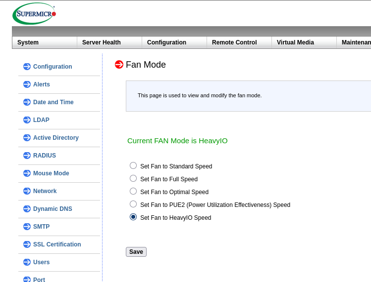

# Server BIOS and BMC Setup

Required BIOS and BMC settings for all servers in the AIsware cluster. Complete these before installing the operating system.

## BMC configuration

Common to all servers — run through the BMC web interface.

Configuration › Account Services — create the following users:

| User name | Password | Network privilege | Account types |
|-----------|----------|-------------------|---------------|
| `operator` | unique per machine | Operator | Redfish/IPMI |
| `metrics` | observability password | User | Redfish/IPMI; SNMP (Auth: HMAC-MD5, Auth Key: observability password, Encryption: None) |

Configuration › Notifications › SNMP:

| Setting | Value |
|---------|-------|
| Enable SNMP | On |
| SNMPv3 | On |
| Auth | HMAC_MD5 |
| Encryption | None |

Configuration › Network › Port:

| Setting | Value |
|---------|-------|
| SNMP Port | On |

Configuration › BMC Settings:

| Setting | Value |
|---------|-------|
| Host Interface | Off |

:::note

Host Interface can only be set from the OS or EFI shell — setting it from the BIOS throws an error. Setting it to Off restricts OS-level IPMI access so that unprivileged OS users cannot add or change accounts or upgrade firmware (equivalent to KCS Control: Operator).

:::

Machines that contain GPUs or network cards should set their fan mode accordingly to help cool these cards.
Go to BMC setting — Configuration › Fan Mode:

| Setting | Value |
|---------|-------|
| Fan Mode | HeavyIO Speed |



## Secure Boot key enrollment

:::info Optional

Only required when Secure Boot is required and when it is not in factory-default state, for example, after a firmware reset or key clear. Note that if the server is re-provisioned, some steps need to be done again.

:::

1. In BIOS, navigate to **Security › Secure Boot**, set CSM Support to **Disabled**, then open **Key Management** and perform the following sequence:
   - **Factory Key Provision**: Enabled → Install factory defaults: Yes → Reset without saving: No
   - **Factory Key Provision**: Disabled — select Disabled again to toggle it off after the factory restore
   - **Reset To Setup Mode**: Yes → Reset without saving: No
   - Esc, then Save Changes and Reset
2. From an Arch Linux machine, install and copy [`sbctl`](https://wiki.archlinux.org/title/Unified_Extensible_Firmware_Interface/Secure_Boot#sbctl) to the target host:
   ```bash
   sudo pacman -S sbctl
   scp /usr/bin/sbctl root@<host>:/usr/local/bin/
   ```
3. On the target host, confirm Setup Mode is active:
   ```bash
   sbctl status
   # Installed:   ✓ sbctl is installed
   # Setup Mode:  ✗ Enabled
   # Secure Boot: ✗ Disabled
   # Vendor Keys: none
   ```
4. Enroll keys and reboot:
   ```bash
   sbctl create-keys   # skip if keys already exist at /usr/share/secureboot
   sbctl enroll-keys -m
   reboot
   ```
5. In BIOS: **Security › Secure Boot › Enter Deployed Mode**, set Secure Boot to **Enabled**, then Save and Reset.
6. Verify enrollment:
   ```bash
   sbctl status
   # Installed:   ✓ sbctl is installed
   # Setup Mode:  ✓ Disabled
   # Secure Boot: ✓ Enabled
   # Vendor Keys: microsoft
   mokutil --pk | grep Issuer  # must not show "DO NOT TRUST - AMI Test PK"
   ```

:::note

After enabling Secure Boot, the nVidia GRID host driver must be reinstalled (rebuilt). The build generates a Machine-Owned Key (MOK) that must be enrolled on the next reboot via the "Perform MOK management" menu. To re-enroll an existing MOK without rebuilding the driver:
```bash
mokutil --import /var/lib/shim-signed/mok/MOK.der
# On reboot: Enroll MOK → Continue → Yes → <MOK password> → Reboot
# Verify:
mokutil --list-enrolled | grep Issuer
```

:::

## BIOS settings

### SuperMicro 5019

| BIOS path | Setting | Value |
|-----------|---------|-------|
| Advanced › Boot Feature | Wait For "F1" If Error | Disabled |
| Advanced › NB Configuration | IOMMU | Enabled |
| Advanced › PCIe/PCI/PnP Configuration | SR-IOV Support | Enabled |
| Advanced › PCIe/PCI/PnP Configuration | PCIe ROM types | EFI (all) |
| Advanced › PCIe/PCI/PnP Configuration | Network Stack | Enabled |
| Advanced › PCIe/PCI/PnP Configuration › Network Stack Configuration | IPv4 PXE Support | Enabled |
| Advanced › PCIe/PCI/PnP Configuration › Network Stack Configuration | IPv6 PXE Support | Disabled |
| Advanced › PCIe/PCI/PnP Configuration › Network Stack Configuration | HTTP Support (all options) | Disabled |
| Security › Secure Boot | CSM Support | Disabled |
| Boot | Boot mode select | UEFI |

:::tip

Save and reset after the PCIe/PCI/PnP changes before continuing to the Secure Boot and Boot settings — some firmware versions require a reboot for the Network Stack sub-menu to appear.

:::

Boot priority: #1 UEFI Hard Disk, #2 UEFI Network, #3 UEFI Built-in EFI Shell, #4–#9 Disabled. Under **UEFI Network Drive BBS Priorities**, disable all entries except the first.

### SuperMicro 1115 and 4125

| BIOS path | Setting | Value |
|-----------|---------|-------|
| Advanced › Boot Feature | Wait For "F1" If Error | Disabled |
| Advanced › NB Configuration | IOMMU | Enabled |
| Advanced › NB Configuration | Power Profile Selection | Efficiency Mode |
| Advanced › PCIe/PCI/PnP Configuration | Above 4G Decoding | Enabled |
| Advanced › PCIe/PCI/PnP Configuration | Re-Size BAR Support | Enabled (required if GPUs are installed) |
| Advanced › PCIe/PCI/PnP Configuration | SR-IOV Support | Enabled |
| Advanced › Network Configuration | IPv6 PXE Support | Disabled |
| Advanced › Network Configuration › 1st NIC › IPv4 Network Configuration | Configured | Enabled |
| Advanced › Network Configuration › 1st NIC › IPv4 Network Configuration | Enable DHCP | Enabled |
| Security › Secure Boot | CSM Support | Disabled |

Boot priority and UEFI Network Drive BBS Priorities: same as 5019 above.

### SuperMicro AS-1115CS, ASG-2115S, and AS-8126GS-NB3RT

GPU hypervisor servers.

| BIOS path | Setting | Value |
|-----------|---------|-------|
| Advanced › Boot Feature | Wait For "F1" If Error | Disabled |
| Advanced › CPU Configuration | Workload Profile | Virtualization (Hypervisors) (AS-1115CS and AS-8126GS-NB3RT only) |
| Advanced › NB Configuration | IOMMU | Enabled |
| Advanced › NB Configuration | DMAr Support | Enabled |
| Advanced › NB Configuration | Power Profile Selection | Auto (High-performance mode) |
| Advanced › PCIe/PCI/PnP Configuration | Above 4G Decoding | Enabled |
| Advanced › PCIe/PCI/PnP Configuration | Re-Size BAR Support | Enabled (required if GPUs installed) |
| Advanced › PCIe/PCI/PnP Configuration | SR-IOV Support | Enabled |
| Advanced › Network Configuration | IPv6 PXE Support | Disabled |

AS-8126GS-NB3RT machines have BlueField-3 NICs. For each NIC port, under **Advanced › Nvidia Network Adapter**:

| Path | Setting | Value |
|------|---------|-------|
| NIC Configuration | Legacy Boot Protocol | None |
| Device Level Configuration | Virtualization Mode | None |
| Device Level Configuration | PXE Boot Filters | Enabled |
| BlueField Internal CPU Configuration | Internal CPU Offload Engine | Disabled (1st port only) |
| (top level) | Network Link Type | Ethernet |

:::note

Virtualization Mode: None enables SR-IOV with 8 virtual functions per port. Internal CPU Offload Engine must be Disabled on the 1st port only.

:::

For GPU servers — create the OS boot RAID array before first boot via **Advanced › BROADCOM SAS 3808N Configuration Utility › Configure › Create Virtual Drive**:
- RAID Level: RAID1
- Media Type: SSD, Interface Type: NVMe
- Select drives C0:01:00 and C1:01:01 → Apply Changes
- Save Configuration: Confirm Enabled → Yes → OK

Boot priority and UEFI Network Drive BBS Priorities: same as 5019 above.

## MS-01 (Intel AMT)

The MS-01 uses Intel Active Management Technology (AMT) for out-of-band management instead of a dedicated BMC.

### BIOS update

If the installed BIOS version is below v1.27, update it first:

1. Format a USB stick with a single EFI FAT32 partition.
2. Place the [UEFI shell binary](https://wiki.archlinux.org/title/Unified_Extensible_Firmware_Interface#UEFI_Shell) on the partition.
3. Download and unpack the [MS-01 BIOS v1.27 package](https://pc-file.s3.us-west-1.amazonaws.com/ms-01/Bios/MS-01-AHWSA-V1.27_4_28_V2.zip) onto the same partition.
4. In BIOS setup, disable **Security › Secure Boot**.
5. Reboot into the EFI shell (force it from the BIOS boot menu if it does not boot automatically).
6. Run `AfuEfiFlash.nsh`.

### AMT setup

1. Enter the BIOS setup screen and open **MEBx** (Intel Management Engine BIOS Extension).
2. Set the AMT password — default credentials are `admin`/`admin`. Store the new password securely.
3. Open **AMT Network Setup** and assign a static IP. Record the address in the static IP inventory for BMC devices.

### BIOS settings

| BIOS path | Setting | Value |
|-----------|---------|-------|
| Advanced › Onboard Devices | Aperture Size | 128 MB |
| Advanced › Onboard Devices | HD Audio | Disabled |
| Advanced › Onboard Devices | Deep S5 | Disabled |
| Advanced › Onboard Devices | SR-IOV | Enabled |
| Advanced › Onboard Devices | Above 4G Decoding | Enabled |
| Advanced › Onboard Devices | Re-Size BAR Support | Enabled |
| Advanced › Onboard Devices | DMA Control Guarantee | Enabled |
| Advanced › Onboard Devices | SA GV | Disabled |
| Advanced › ACPI Settings | Restore On AC Power Loss | Always On |
| Advanced › ACPI Settings | Wake Up On LAN | Enabled |
| Advanced › HM Monitor & Smart Fan | CPU Fan Smart Mode | Full Mode |
| Advanced › HM Monitor & Smart Fan | M.2 Fan 1 Smart Mode | Full Mode |
| Advanced › HM Monitor & Smart Fan | M.2 Fan 2 Smart Mode | Full Mode |
| Advanced › Network Stack Configuration | Network Stack | Disabled |
| Advanced › Network Stack Configuration | IPv4 PXE Support | Disabled |
| Advanced › Network Stack Configuration | IPv6 PXE Support | Disabled |
| Security | Secure Boot | Disabled (BIOS update and OS install); Enabled (post-install) |

### AMT activation

After completing the BIOS settings:

1. In the AMT BIOS menu, set **Network Access State** to **Network Active**.
2. In the AMT BIOS menu, open the **User Consent** menu and set:
   - **User Opt-in**: None
   - **Opt-in Configurable from Remote IT**: Enabled

### Connecting via AMT

Use [MeshCommander](https://www.meshcommander.com/) (bundled in the `meshcmd` tool) to connect to an AMT device:

```bash
wget "https://alt.meshcentral.com/meshagents?meshcmd=6" -O meshcmd
chmod +x meshcmd
./meshcmd MeshCommander
```

Open http://localhost:3000, then:

1. **Add Computer**
2. Fill in:
   - **Friendly Name**: name matching the inventory
   - **Hostname**: `<inventory-name>.<environment-tld>` — the DHCP/DNS entry configured in the routers
   - **Auth / Security**: Digest / TLS
3. **OK**, then **Connect**
