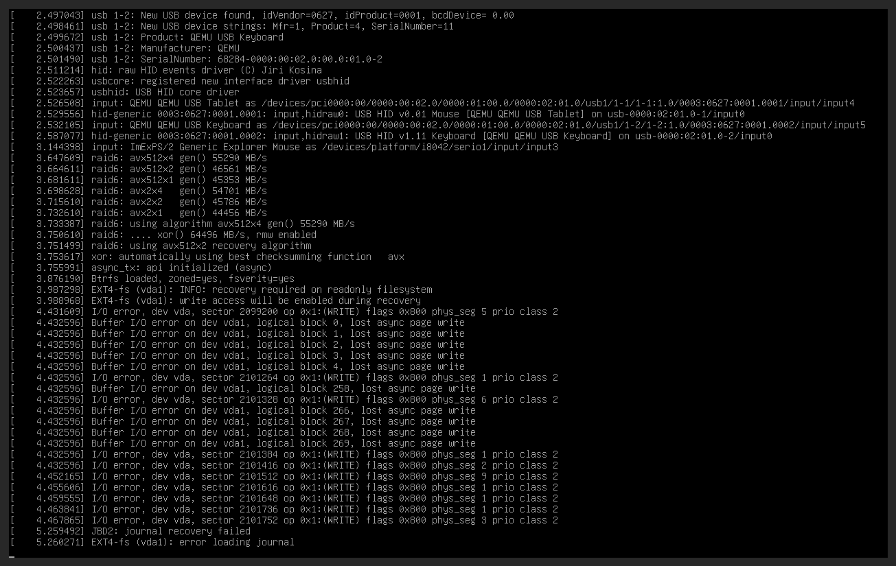

# Recovering a locked RBD volume

Unlock a Ceph RBD volume stuck after a VM hard crash

When a VM crashes hard (for example, due to a hypervisor failure), it may leave a stale exclusive lock on its underlying Ceph RBD volume(s), with the following symptom(s):
- OpenStack reports the volume as `available` but it cannot be deleted (even if the VM that was attaching it is shut down or deleted) or successfully attached and mounted
- the VM is stuck at boot because it can not write to its own disks (e.g. it can not fsck its root disk), for example as in the screenshot below:



This runbook describes how to identify the stale lock, remove it, and restart the VM or delete the volume(s).

---

## Prerequisites Checklist

- [ ] to clear the lock:
  - SSH + `sudo` access to a Ceph monitor node (`ceph_mon_hosts` in inventory)
- [ ] to confirm the VM volumes, either:
  - SSH + `sudo` access to the compute node running (or that ran) the VM
  - or access to the OpenStack UI
- [ ] to restart the VM or delete volumes, either:
  - OpenStack CLI configured and authenticated (e.g. in `deployment0` using the deployment container)
  - or access to the OpenStack UI

All `rbd` commands in this runbook must be run inside a `cephadm shell`. Connect to any monitor node and enter the shell before starting:

```bash
ssh <ceph-node>
sudo cephadm shell
```

---

## Step 1: Identify the affected VM and/or volume(s)

From the openstack UI or console, let us get the VM and volume(s) UUID.

First, get the VM UUID:

```sh
openstack server list --all --name flo-crash-test-dummy -f value -c id -c name
c3c87ece-0ac1-4d22-974f-902be4bcf0a2 flo-crash-test-dummy
```

Our VM UUID is `c3c87ece-0ac1-4d22-974f-902be4bcf0a2`. Use it to get the VM details:

```sh
openstack server show c3c87ece-0ac1-4d22-974f-902be4bcf0a2
+-------------------------------------+-----------------------------------------------------------------------------------------------+
| Field                               | Value                                                                                         |
+-------------------------------------+-----------------------------------------------------------------------------------------------+
| OS-DCF:diskConfig                   | MANUAL                                                                                        |
| OS-EXT-SRV-ATTR:host                | gpu1                                                                                          |
| OS-EXT-SRV-ATTR:hostname            | flo-crash-test-dummy                                                                          |
| OS-EXT-SRV-ATTR:hypervisor_hostname | gpu1                                                                                          |
| OS-EXT-SRV-ATTR:instance_name       | instance-00000dc5                                                                             |
| OS-EXT-SRV-ATTR:kernel_id           |                                                                                               |
| OS-EXT-SRV-ATTR:launch_index        | 0                                                                                             |
| OS-EXT-SRV-ATTR:ramdisk_id          |                                                                                               |
| OS-EXT-SRV-ATTR:reservation_id      | r-gj34c0pq                                                                                    |
| OS-EXT-SRV-ATTR:root_device_name    | /dev/vda                                                                                      |
...
| description                         | flo-crash-test-dummy                                                                          |
| hostId                              | de8ecfe60d203e4c5e676e0d60037a7ba394fd8b6e5e848ddd54b705                                      |
| host_status                         | UP                                                                                            |
| id                                  | c3c87ece-0ac1-4d22-974f-902be4bcf0a2                                                          |
| image                               | Ubuntu Server Noble LTS (Cloud) raw (74d974a4-3060-40dd-9e9e-fe9b29825f23)                    |
| key_name                            | vm-flo-crash-test-dummy-d6c78a27-63b5-41b4-94dd-32902bb90116                                  |
| locked                              | False                                                                                         |
| locked_reason                       | None                                                                                          |
| name                                | flo-crash-test-dummy                                                                          |
...
| volumes_attached                    |                                                                                               |
+-------------------------------------+-----------------------------------------------------------------------------------------------+
```
Note the VM `instance_name`, as well as any `volumes_attached`.

In this case: `instance_name` is `instance-00000dc5`, and we don't have extra volumes.

You can also confirm the volume status with:

```bash
openstack volume list --all --long
```


---

## Step 2: Check whether a VM holds the volume

Check whether the volume is still attached to a VM in OpenStack:

```bash
openstack volume show <volume-id>
```

Look at the `attachments` field. If a server is listed, check its status:

```bash
openstack server show <server-id>
```

Expected state for a crashed VM: `ERROR` or `SHUTOFF`.


## Step 3: Confirm the VM is not actively running

Before touching the Ceph lock, confirm that the volume is not in use.

If the VM is in `ERROR` or `SHUTOFF` state, it is safe to proceed. If the VM is `ACTIVE`, shut it down first:

```bash
openstack server stop <server-id>
```

Wait for the VM to reach `SHUTOFF` before continuing:

```bash
openstack server show <server-id> | grep status
```

---

## Step 4: Find the RBD image and its lock status

SSH to the compute node and dump the libvirt XML to find the exact pool and image names:

```bash
virsh dumpxml <instance_name> | grep rbd
```

For example:

```
# virsh dumpxml instance-00000dc5 | grep rbd
      <source protocol='rbd' name='vms/c3c87ece-0ac1-4d22-974f-902be4bcf0a2_disk'>
      <source protocol='rbd' name='vms/c3c87ece-0ac1-4d22-974f-902be4bcf0a2_disk.config'>
```

Note the pool (`vms`) and the image names (`vms/<instance-uuid>_disk` and `vms/<instance-uuid>_disk.config`).

Back on the Ceph monitor node (inside `cephadm shell`), confirm the lock:

```bash
rbd lock list <volume name>
```

For example:

```bash
rbd lock list vms/c3c87ece-0ac1-4d22-974f-902be4bcf0a2_disk
There is 1 exclusive lock on this image.
Locker         ID                    Address
client.798189  auto 126489337364128  10.30.0.14:0/1684650053
rbd lock list vms/c3c87ece-0ac1-4d22-974f-902be4bcf0a2_disk.config

```
There is a lock on the VM root disk (but not on the config disk) that was preventing the VM from starting up.

---

## Step 5: Create a backup of the volume(s)

To protect against data loss (e.g. by `fsck` during the VM restart), let's create a snapshot of the affected volume(s):

```bash
rbd snap create vms/<instance-uuid>_disk@pre-recovery-$(date +%Y%m%d)
```

To roll back to it if something goes wrong:

- When the volume is not mounted (no active VMs using it)

```bash
rbd snap rollback vms/<instance-uuid>_disk@pre-recovery-20260605
```

## Step 6: Remove the stale RBD lock

List the locks on the image:


Remove the lock using the **Locker** and **ID** values from the output. In the example at last step, the ID contains a space, so it must be quoted:

```bash
rbd lock remove vms/<instance-uuid>_disk "<id>" <locker>
```

For example:

```bash
rbd lock remove vms/c3c87ece-0ac1-4d22-974f-902be4bcf0a2_disk "auto 126489337364128" client.798189
```

Confirm the lock is gone:

```bash
rbd lock list vms/<instance-uuid>_disk
```

Expected output: empty.

---

## Step 7: Recover VMs

If the goal is to bring the VM back into service, restart it via OpenStack or the AI Factory Console.

```bash
openstack server start <server-id>
```

Monitor the VM until it reaches `ACTIVE`:

```bash
openstack server show <server-id> | grep status
```

Verify the volume is accessible inside the VM.


## Troubleshooting


### VM fails to restart after lock removal

Check the VM console log for errors:

```bash
openstack console log show <server-id>
```

If the disk was corrupted by the crash, the VM may need to be rebuilt rather than restarted.

## Annex: Practicing this runbook / reproducing

In order to simulate a hypervisor crash in QA environment, one needs to send the KILL signal to the QEMU process in charge of the VM.

The prerequisites are the same as this runbook (ssh + `sudo` access to hypervisor nodes)

- Create a VM in AI Factory Console
- find its hypervisor host and instance name (here, `gpu0` and `instance-00000dc5`)
- ssh to the hypervisor host
- find the PID of the qemu hypervisor process, e.g.
```bash
sudo ps aux | grep instance-00000dc5 | grep -v grep
42436     780757  4.2  1.0 20016640 2721160 ?    Sl   08:47   2:59 /usr/bin/qemu-system-x86_64 -name guest=instance-00000dc5,debug-threads=on -S [...]
```
The PID is the second output field: `780757`
- send this PID the KILL signal:
```bash
sudo kill -9 745972
```
