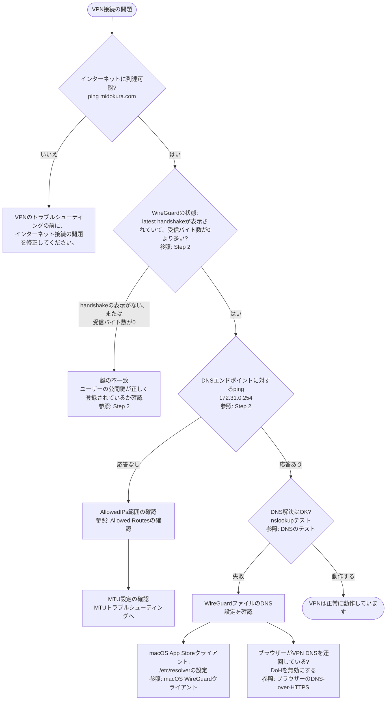

import Tabs from '@theme/Tabs';
import TabItem from '@theme/TabItem';

# VPN構成 (サービスオペレーター向け)

サービスオペレーターとしてVPNを設定します。

本ガイドでは、テナントに割り当てられたユーザーのVPNアクセスを
サービスオペレーターが設定する方法を説明します。

WireGuardの設定方法に関しては
[WireGuard Quick Start guide](https://www.wireguard.com/quickstart/)
を参照してください。

## 概要

オペレーターは、ユーザーをテナントに追加する際、そのユーザーのための
VPN構成スクリプトを生成できます。
ユーザーは、生成されたスクリプトと自身の秘密鍵を組み合わせてVPN構成を
生成します。
本ページでは、サービスオペレーター側の手順を説明します。
ユーザー側の手順は[こちら](/docs/user/VPN_CONFIGURATION)を参照してください。

## セットアップ手順

ユーザーは事前にWireGuardのキーペアを生成し、公開鍵をサービスオペレーターへ
共有します。
その後、以下の手順でVPNのセットアップを進めます。

1. オペレーターは、ユーザーの公開鍵を使用して対象テナントにユーザーを追加します。
2. オペレーターは、VPN設定スクリプトを取得し、ユーザーへ提供します。

## テナントへのユーザーの追加

ユーザーから公開鍵を受け取ったら、対象のテナントにユーザーを追加します。
その際、ユーザーのWireGuard公開鍵をVPNアクセス設定の`pubkey`フィールドに
指定してください。

APIの詳細や例は、Operator API Guideの
[Add User to Tenant](OPERATOR_API_GUIDE.md#add-user-to-tenant)
を参照してください。

## VPN設定スクリプトの取得と提供

VPN設定スクリプトをユーザー向けに取得します。

```bash
curl -H "Authorization: Bearer $JWT_TOKEN" \
     -H "Content-Type: application/json" \
     "${API_BASE_URL}/users/${USER_ID}/vpn" > vpn-config-script.sh
```

取得したスクリプトをユーザーに提供します。

## VPN Configuration Reference

上記で取得した設定スクリプトを実行すると、
WireGuard設定ファイルが以下の形式で生成されます。
ユーザー固有の値は、スクリプトが自動で挿入します。
ここでは、プレースホルダーを使用して説明します。

```ini
[Interface]
# ユーザーが生成・管理する鍵です。
# オペレーターと共有しないでください。
PrivateKey = <user private key>
# APIによりユーザーごとに割り当てられるVPNのIPアドレス。
Address = 172.31.42.42/32
# テナント内のユーザー全員で共有するVPNのDNSサーバー。
# 検索ドメインが続く場合があります。(macOSのApp Storeクライアント
# ではサポートされません。詳細はトラブルシューティングを参照してください。)
DNS = 172.31.0.254, tld
# オプション: ユーザーのネットワークのMTUが1500バイト未満の場合に
# 設定してください。(例：IPv6 上で IPv4 を使用する環境)
MTU = 1312

[Peer]
# VPNサーバーの公開鍵。テナント内のすべてのユーザーで共通です。
PublicKey = ExampleServerPublicKey+/+/+/+/+/+/+/+/+/+/+=
# VPN経由でルーティングされるIPアドレスの範囲
AllowedIPs = 10.8.42.0/24, 172.31.42.0/24
# VPNサーバーのアドレスとポート番号
Endpoint = vpn.example.com:4242
# オプション: NATを経由した接続を維持するため、キープアライブパケットを
# 送信する間隔 (秒) を指定します。
PersistentKeepAlive = 25
```

## トラブルシューティング

ユーザーからVPNに接続できないという報告があった場合は、
以下のフローチャートを使用して原因を切り分けてください。
対処方法は、該当するセクションを参照してください。



### 接続状態の確認

WireGuardには、無効なパケットは無視されるという特徴があります。
そのため、いずれかの接続に無効な鍵が使用されても相手側には警告されません。
エラーが表示されない場合でも、接続が成功しているとは限りません。トラブルシューティングを段階的に行ってください。

#### Step 1: サーバーに接続できることを確認

WireGuardのエンドポイントにpingし、ネットワークの接続性を確認します。

```bash
# まず、インターネットへの接続を確認します。
ping midokura.com
# 次に、VPNサーバーにpingしてみます。
ping vpn.example.com
```

:::note

pingに応答しないよう、VPNサーバーを意図的に設定している場合があります。

:::

#### Step 2: VPNの接続を確認

WireGuard接続を有効にした後:

##### WireGuardのステータスを確認

<Tabs groupId="os">
<TabItem value="linux" label="Linux">

WireGuardクライアントの状態をローカルで確認:

`$ sudo wg`

接続に成功している場合の出力例:

```bash
interface: wg-tenant
  public key: ExampleUserPublicKey+/+/+/+/+/+/+/+/+/+/+/+=
  private key: (hidden)
  listening port: 49913

peer: ExampleServerPublicKey+/+/+/+/+/+/+/+/+/+=
  endpoint: 203.0.113.42:4242
  allowed ips: 10.8.42.0/24, 172.31.42.0/24
  latest handshake: 1 minute, 30 seconds ago
  transfer: 24.92 KiB received, 24.55 KiB sent
  persistent keepalive: every 25 seconds
```

クライアントの鍵、またはサーバーの鍵が間違っている場合の出力例:

```bash
interface: wg-tenant
  public key: ThisIsAnExampleOfIncorrectClientPublicKey+/=
  private key: (hidden)
  listening port: 45986

peer: ExampleServerPublicKey+/+/+/+/+/+/+/+/+/+=
  endpoint: 203.0.113.42:4242
  allowed ips: 10.8.42.0/24, 172.31.42.0/24
  transfer: 0 B received, 444 B sent
  persistent keepalive: every 25 seconds
```

:::note

この場合:
- データは送信されています（ただし、サーバー側で正常に受信されたかどうかは確認できません）。
- 受信されたデータは 0 バイトです。サーバーを検証できずにデータが無視されているか、
  サーバーがクライアントを検証できず応答していません。
- `latest handshake` のタイムスタンプが見つかりません。

:::

</TabItem>
<TabItem value="macos" label="macOS">

[Mac App Store版のWireGuardアプリ](https://apps.apple.com/us/app/wireguard/id1451685025?mt=12)には、
`wg`コマンドラインツールが含まれていないため、`sudo wg`を使用できません。

トンネルの状態を確認するには、macOSメニューバーにある**Manage Tunnels**を開いてください。
last handshakeのタイムスタンプや設定された各トンネルの転送データ量など、接続状態を確認できます。

正常に接続されている場合は、受信バイト数が表示されます。
受信バイト数が0のままhandshakeが行われない場合は、鍵の設定が正しく行われていません。
その場合、ユーザーの公開鍵が正しく登録されているか確認してください。

</TabItem>
</Tabs>

##### DNSエンドポイントへのping

DNSエンドポイントのIPアドレスに対してpingを実行すると、VPN経由でサーバーに接続できるかどうかを確認できます。

```bash
ping 172.31.0.254
```

pingが成功した場合は、WireGuard接続が正常に動作していることを示します。

### DNSのテスト

VPN経由でリソースへアクセスするには、DNSが正しく設定されている必要があります。
トラブルシューティングを段階的に行ってください。

```bash
# 構成にあるVPNサーバーを経由した公開ドメイン名による解決テスト
nslookup midokura.com 172.31.0.254

# "tld"サブドメインが解決できる事を確認 (WireGuard DNS設定に存在する場合)
nslookup myvm.tenant.example.tld 172.31.0.254

# ".tld" DNSクエリーがデフォルトでVPNに送信される事を確認
nslookup myvm.tenant.example.tld

# IA Factory ConsoleのURLが解決できる事を確認
nslookup console.aifactory.example.tld 172.31.0.254

# 接続時、DNSリゾルバーが正しく設定されている事を確認
nslookup console.aifactory.example.com
```

いずれのコマンドも、有効なIPアドレスが返されることを確認してください。
DNS解決に失敗する場合は、WireGuard設定に指定されているDNSサーバーが正しいこと、およびDNSサーバーへ到達できることを確認してください。

:::note macOS App Store版クライアントではサーチドメインはサポートされていません

App Store版クライアントは、`DNS`フィールドのサーチドメイン接尾詞 (例： `DNS = 172.31.0.254, tld`) をサポートしていません。
サーチドメインなしのDNSサーバーアドレスを使用してください。

```ini
DNS = 172.31.0.254
```

この設定では、サーチドメインに一致するDNSクエリだけでなく、すべてのDNSクエリがVPN経由で送信されます。

または、`resolver(5)`システムリゾルバーを使用して、サーチドメインを設定する事もできます。

```ini
# /etc/resolver/ai-factory.tld
domain tld
search tld
nameserver 172.31.0.254
```

詳細は、macOSの`resolver(5)`マニュアルページを参照してください。

:::

### VPNトラブルシューティング (上級)

以下の手順は、OS やブラウザー、インターネット接続環境に依存する内容であり、
通常は実施する必要はありません。

#### Allowed Routesの確認

VPN経由でアクセスするリソースは、WireGuard設定の `AllowedIPs` に含まれている必要があります。
例えば、ユーザーが`10.0.0.5`上のサービスにアクセスする場合、`AllowedIPs`には、
`10.0.0.0/8` またはより具体的な範囲を指定する必要があります。

アクセスに必要なすべてのネットワークが含まれているか、`AllowedIPs`の設定を確認してください。

```ini
AllowedIPs = 10.8.42.0/24, 172.31.0.0/24
```

`AllowedIPs`には通常、少なくとも以下2つのネットワークが含まれます。

- テナントVPNのアドレス範囲。この設定例では、クライアントのアドレスは`172.31.42.42/32`で、範囲は`172.31.42.0/24`です。
- テナント内ネットワークリソースのアドレス範囲。本設定例では、`10.8.42.0/24`です。

リソースへ接続できない場合は、以下リソースアドレスを確認してください。
- VPNネットワーク上で有効なアドレスですか。
- VPN設定に含まれているアドレスですか。
- ローカルネットワーク (VPN以外) とVPNのアドレス範囲が競合していませんか。

#### MTUトラブルシューティング

MTU (最大送信単位) が原因で、パケットが破棄される場合があります。
例えば、IPv6上でIPv4を利用するネットワークでは、MTUが標準の1500バイトより小さくなる場合があります。
ローカルのネットワークゲートウェイがMTUを適切に処理できる環境では、本設定は必ずしも必要ありません。

以下の手順でMTUの接続を確認できます。

<Tabs groupId="os">
<TabItem value="linux" label="Linux">

```bash
ping -4 -M do -s 1472 example.com
```

:::note

IPv4ヘッダーは20バイト、ICMPヘッダーは8バイトがパケット長に追加されます。
つまり、1500バイトのパケットを送信するには、ペイロード長を1472バイトに設定する必要があります。

:::

失敗する場合は、1400や1300などより小さいパケット長を指定し、正常に通信できる最大パケット長を確認してください。
また、VPN設定のMTU値が適切であることも確認してください。

出力例:

```bash
ping -4 -M do -s 1352 midokura.com
PING midokura.com (198.51.100.42) 1472(1500) bytes of data.
From _gateway (192.168.1.1) icmp_seq=1 Frag needed and DF set (mtu = 1380)
ping: sendmsg: Message too long
^C
ping -M do -s 1352 midokura.com
PING midokura.com (198.51.100.42) 1352(1380) bytes of data.
1360 bytes from 42-100.midokura.com (198.51.100.42): icmp_seq=1 ttl=47 time=12 ms
^C
```

:::note

この例では、ルーターがMTUを認識しており、パケットサイズを適切に処理しています。
「MTUが1380バイトのため、パケットをフラグメント化しなければ送信できない」
というメッセージがルーターから返されます。

この場合、クライアント側でのMTU設定は必要ありません。
パケット長1472では失敗し、1352では成功する場合、MTUが1380以上1500未満であることがpingから分かります。

:::

</TabItem>
<TabItem value="macos" label="macOS">

macOSでMTUをテストするには、次のコマンドを実行してください。

```sh
ping -D -s 1472 midokura.com
```

失敗する場合は、1400や1300などより小さいパケット長を指定し、正常に通信できる最大パケット長を確認してください。
また、VPN設定のMTU値が適切であることも確認してください。

</TabItem>
</Tabs>

#### UbuntuとNetworkManager

Ubuntuは、WireGuard VPNを含むネットワーク接続の管理にNetworkManagerを使用します。
NetworkManagerでは`wg`を利用したヘルプ機能が用意されています。本ガイドのトラブルシューティングをそのまま適用できます。
ただし、設定を変更した後に接続の問題が発生した場合は、VPN接続の再接続または DNSキャッシュのクリアを行うことで改善する場合があります。

**VPN接続の再起動:**

```bash
sudo nmcli connection down <vpn-connection-name>
sudo nmcli connection up <vpn-connection-name>
```

**DNSキャッシュのフラッシュ:**

```bash
sudo resolvectl flush-caches
```

### ブラウザーのDNS-over-HTTPS (DoH)

DNS-over-HTTPS（DoH）機能により、VPNのDNS設定が使用されず、VPN経由でのみアクセス可能なリソースの名前解決に失敗する場合があります。

#### Firefox

FirefoxでシステムのDNSリゾルバーを使用できるようにするには、以下の手順を実行します。

1. [Firefoxのprivacy preferencesページ](about:preferences#privacy)を開きます
2. **DNS over HTTPS**までスクロールします
3. **Default Protection**または**Increased Protection**を選択してシステムDNSの使用を許可するか、
   **Off**を選択してDoHを無効にします

#### Chrome

ChromeでDoHを無効にするには、以下の手順を実行します。

1. [Chromeの設定ページ](chrome://settings/security)を開きます
2. **Use secure DNS**までスクロールします
3. トグルをオフにするか、**With your current service provider**を選択します
